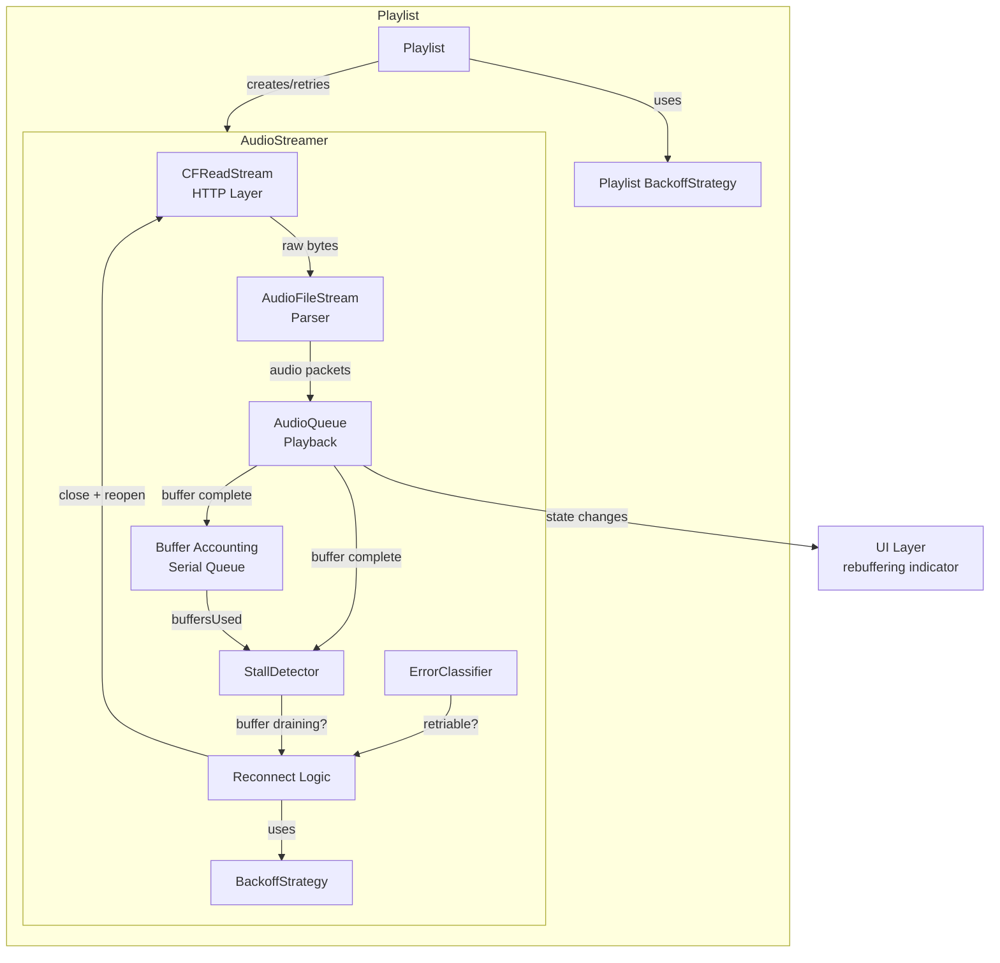
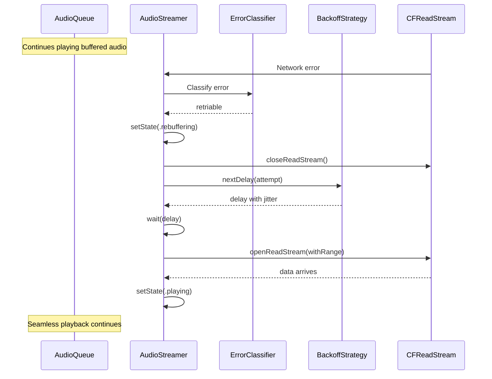

# Design Document: Audio Stream Resilience

## Overview

This design overhauls the audio streaming resilience system in Hermes to make playback robust against network interruptions. The core architectural change is **in-place stream reconnection**: when a network error occurs, only the CFReadStream (HTTP layer) is torn down and rebuilt, while the AudioQueue and its buffers remain intact. This allows buffered audio to continue playing during reconnection, eliminating the multi-second silence gaps caused by the current approach of destroying everything and starting from scratch.

The design introduces four new components layered onto the existing AudioStreamer/Playlist architecture:

1. **ErrorClassifier** — categorizes network errors as retriable or non-retriable
2. **BackoffStrategy** — computes exponential backoff delays with jitter
3. **StallDetector** — monitors buffer health using hysteresis to trigger proactive reconnects
4. **Thread-safe buffer accounting** — serializes all buffer state mutations through a dedicated DispatchQueue

A new `rebuffering` state is added to `AudioStreamerState` so the UI can display reconnection status.

## Architecture



### Reconnection Flow



## Components and Interfaces

### ErrorClassifier

A pure value-type utility that categorizes errors. No state, no side effects — just classification logic.

```swift
enum NetworkErrorCategory {
    case retriable
    case nonRetriable
}

struct ErrorClassifier {
    static func classify(_ error: Error) -> NetworkErrorCategory
    static func classifyHTTPStatus(_ statusCode: Int) -> NetworkErrorCategory
}
```

**Classification rules:**

- Retriable: POSIX errors 50 (network down), 54 (connection reset), 61 (connection refused), 65 (host unreachable); DNS failures; TLS handshake failures; HTTP 5xx, 408, 429; CFNetwork timeouts
- Non-retriable: HTTP 4xx (except 408, 429); audio format/queue errors; parse failures

### BackoffStrategy

A struct that computes delays. Holds configuration but the attempt counter lives in the caller.

```swift
struct BackoffStrategy {
    let baseDelay: TimeInterval
    let maxDelay: TimeInterval
    let jitterRange: TimeInterval
    
    func delay(forAttempt attempt: Int) -> TimeInterval {
        let exponential = min(baseDelay * pow(2.0, Double(attempt)), maxDelay)
        let jitter = Double.random(in: 0..<jitterRange)
        return exponential + jitter
    }
    
    static let streamerDefault = BackoffStrategy(
        baseDelay: 0.5, maxDelay: 16.0, jitterRange: 0.5
    )
    
    static let playlistDefault = BackoffStrategy(
        baseDelay: 1.0, maxDelay: 30.0, jitterRange: 1.0
    )
}
```

### StallDetector

Encapsulates the hysteresis logic for proactive reconnection. Tracks whether buffers have reached the high mark and whether they've subsequently drained below the low mark.

```swift
struct StallDetector {
    let highMark: Double  // 0.75
    let lowMark: Double   // 0.25
    
    private(set) var armed: Bool = false
    
    mutating func evaluate(fillRatio: Double, hasQueuedPackets: Bool, isReconnecting: Bool) -> Bool
    mutating func reset()
}
```

`evaluate` returns `true` when a proactive reconnect should be triggered. It arms when `fillRatio >= highMark`, and triggers when `fillRatio < lowMark` while armed, with no queued packets, and no reconnect already in progress.

### AudioStreamerState Changes

Add `rebuffering` case to the existing enum:

```swift
public enum AudioStreamerState: Equatable {
    case initialized
    case waitingForData
    case waitingForQueueToStart
    case playing
    case paused
    case rebuffering          // NEW: reconnecting HTTP stream, AudioQueue still playing
    case done(reason: DoneReason)
    case stopped
}
```

### AudioStreamError Changes

Add retriable classification to the error type:

```swift
extension AudioStreamerError {
    /// Whether this error is potentially retriable at the stream level
    var isRetriable: Bool {
        switch self {
        case .networkConnectionFailed, .timeout:
            return true
        default:
            return false
        }
    }
}
```

### AudioStreamer Reconnection Logic

The core change is a new `attemptInPlaceReconnect()` method that replaces the current destructive `failWithError()` path for retriable errors:

```swift
// Pseudocode for the reconnection flow
func attemptInPlaceReconnect() {
    guard reconnectAttempts < maxReconnectAttempts else {
        failWithError(.networkConnectionFailed(underlyingError: "Max reconnect attempts exceeded"))
        return
    }
    
    setState(.rebuffering)
    closeReadStream()  // Only closes CFReadStream, NOT AudioQueue
    
    let delay = backoffStrategy.delay(forAttempt: reconnectAttempts)
    reconnectAttempts += 1
    
    // Calculate byte offset from current position
    updateSeekPositionFromProgress()
    
    scheduleReconnect(after: delay) {
        if !self.openReadStream() {
            self.attemptInPlaceReconnect()  // Retry with next backoff
        } else {
            // Stream opened, data will flow through existing callbacks
            // State transitions back to .playing when data arrives
        }
    }
}
```

### Thread-Safe Buffer Accounting

All buffer state mutations go through the existing `bufferQueue` serial DispatchQueue. The key change is that `handleBufferComplete` (called from AudioQueue's internal thread) dispatches to `bufferQueue` instead of directly mutating state:

```swift
func handleBufferComplete(queue: AudioQueueRef, buffer: AudioQueueBufferRef) {
    bufferQueue.async { [weak self] in
        guard let self = self else { return }
        // All buffer state mutations happen here
        self.bufferInUse[index] = false
        self.buffersUsed = max(0, self.buffersUsed - 1)  // Cannot underflow
        // ... rest of logic
    }
}
```

The `buffersUsed` decrement uses `max(0, buffersUsed - 1)` to eliminate the underflow risk entirely, and the serial queue ensures no concurrent mutation.

### Smart Timeout Logic

The timeout check is enhanced to consider buffer health:

```swift
func checkTimeout() {
    guard state != .paused else { return }
    
    let currentFillRatio = Double(buffersUsed) / Double(bufferCount)
    
    if eventCount > 0 {
        // Data arrived, but check if buffers are still draining
        if lastFillRatio - currentFillRatio > 0.20 {
            // Trickle of data but buffers draining fast — treat as stalled
            attemptInPlaceReconnect()
        }
        eventCount = 0
        lastFillRatio = currentFillRatio
        return
    }
    
    // No data at all — reconnect instead of terminal failure
    attemptInPlaceReconnect()
}
```

### Playlist Retry Changes

Playlist's `handleStreamError` uses `BackoffStrategy.playlistDefault` instead of a flat 1-second delay:

```swift
private func handleStreamError(_ error: AudioStreamerError) {
    if !retrying {
        lastKnownSeekTime = stream?.progress() ?? 0
    }
    
    guard tries <= maxRetries else {
        NotificationCenter.default.post(name: ASStreamError, object: self)
        return
    }
    
    let delay = playlistBackoff.delay(forAttempt: tries)
    tries += 1
    
    DispatchQueue.main.asyncAfter(deadline: .now() + delay) { [weak self] in
        self?.retry()
    }
}
```

## Data Models

### BackoffStrategy

| Field | Type | Description |
|-------|------|-------------|
| `baseDelay` | `TimeInterval` | Starting delay before first retry (0.5s for streamer, 1.0s for playlist) |
| `maxDelay` | `TimeInterval` | Maximum cap on computed delay (16s for streamer, 30s for playlist) |
| `jitterRange` | `TimeInterval` | Range for random jitter added to delay (0.5s for streamer, 1.0s for playlist) |

### StallDetector

| Field | Type | Description |
|-------|------|-------------|
| `highMark` | `Double` | Fill ratio threshold to arm the detector (0.75) |
| `lowMark` | `Double` | Fill ratio threshold to trigger reconnect when armed (0.25) |
| `armed` | `Bool` | Whether buffers have previously reached the high mark |

### NetworkErrorCategory

| Case | Description |
|------|-------------|
| `retriable` | Transient error, should attempt reconnection |
| `nonRetriable` | Permanent error, should fail immediately |

### AudioStreamer Reconnection State (new fields)

| Field | Type | Description |
|-------|------|-------------|
| `reconnectAttempts` | `Int` | Current count of in-place reconnect attempts |
| `maxReconnectAttempts` | `Int` | Maximum allowed (5) |
| `streamerBackoff` | `BackoffStrategy` | Backoff configuration for stream-level retries |
| `stallDetector` | `StallDetector` | Hysteresis-based buffer health monitor |
| `lastFillRatio` | `Double` | Buffer fill ratio at last timeout check |
| `reconnectTimer` | `Timer?` | Timer for scheduled reconnect attempts |

### Playlist Retry State (modified fields)

| Field | Type | Description |
|-------|------|-------------|
| `maxRetries` | `Int` | Changed from 2 to 4 |
| `playlistBackoff` | `BackoffStrategy` | Backoff configuration for playlist-level retries |

## Correctness Properties

*A property is a characteristic or behavior that should hold true across all valid executions of a system — essentially, a formal statement about what the system should do. Properties serve as the bridge between human-readable specifications and machine-verifiable correctness guarantees.*

The following properties were derived from the acceptance criteria through prework analysis. Redundant criteria were consolidated (e.g., 1.1, 1.2, and 2.4 all express the same AudioQueue preservation invariant).

### Property 1: AudioQueue preservation during in-place reconnect

*For any* AudioStreamer that is playing and encounters a retriable network error, after initiating an in-place reconnect, the AudioQueue reference and all allocated AudioQueue buffers SHALL remain non-nil and undisposed. The reconnect process SHALL only close and reopen the CFReadStream.

**Validates: Requirements 1.1, 1.2, 2.4**

### Property 2: Reconnect state machine transitions

*For any* AudioStreamer in the playing state that initiates an in-place reconnect, the state SHALL transition to `rebuffering`. *For any* AudioStreamer in the `rebuffering` state that successfully receives new audio data, the state SHALL transition back to `playing`. No other state transitions are valid from `rebuffering` except to `playing` or to `done(reason: .error(...))`.

**Validates: Requirements 2.2, 2.3**

### Property 3: StallDetector hysteresis correctness

*For any* sequence of buffer fill ratios fed to the StallDetector:

- `evaluate` SHALL return `false` until the fill ratio has reached or exceeded the high mark (0.75) at least once.
- After arming (fill ratio >= high mark), `evaluate` SHALL return `true` only when the fill ratio drops below the low mark (0.25) AND `hasQueuedPackets` is `false` AND `isReconnecting` is `false`.
- `evaluate` SHALL always return `false` when `isReconnecting` is `true`, regardless of fill ratio.

**Validates: Requirements 3.2, 3.3, 3.4**

### Property 4: Error classification correctness

*For any* NSError with a POSIX domain and code in {50, 54, 61, 65}, the ErrorClassifier SHALL return `.retriable`. *For any* HTTP status code in the 5xx range, or equal to 408 or 429, `classifyHTTPStatus` SHALL return `.retriable`. *For any* HTTP status code in the 4xx range (excluding 408 and 429), `classifyHTTPStatus` SHALL return `.nonRetriable`. The classification of any error SHALL be deterministic — the same error always produces the same category.

**Validates: Requirements 4.1, 4.2**

### Property 5: Backoff delay bounds

*For any* `BackoffStrategy` with parameters `(baseDelay, maxDelay, jitterRange)` and *for any* non-negative attempt number, the computed delay SHALL be in the range `[min(baseDelay * 2^attempt, maxDelay), min(baseDelay * 2^attempt, maxDelay) + jitterRange)`. The delay SHALL always be non-negative and SHALL never exceed `maxDelay + jitterRange`.

**Validates: Requirements 5.1**

### Property 6: Timeout considers buffer health

*For any* pair of fill ratios `(lastFillRatio, currentFillRatio)` where data has arrived (eventCount > 0) but `lastFillRatio - currentFillRatio > 0.20`, the smart timeout logic SHALL treat the connection as stalled. *For any* timeout check while in the paused state, the timeout logic SHALL take no action regardless of event count or fill ratio.

**Validates: Requirements 6.2, 6.4**

### Property 7: Buffer counter non-negative invariant

*For any* sequence of buffer enqueue and dequeue operations applied to `buffersUsed`, the value SHALL remain in the range `[0, bufferCount]` at all times. No sequence of operations SHALL cause `buffersUsed` to underflow below zero or overflow above `bufferCount`.

**Validates: Requirements 7.4**

## Error Handling

### Error Flow

Errors flow through three layers with increasing severity:

1. **ErrorClassifier** — First contact. Categorizes the raw error as retriable or non-retriable.
2. **AudioStreamer in-place reconnect** — For retriable errors, attempts up to 5 reconnections with exponential backoff. The AudioQueue keeps playing from buffers during this process.
3. **Playlist fresh-stream retry** — If the AudioStreamer exhausts its reconnect attempts and transitions to `.done(reason: .error(...))`, the Playlist catches this, creates a brand new AudioStreamer, and retries up to 4 times with its own backoff strategy.
4. **Terminal failure** — If the Playlist exhausts its retries, it posts `ASStreamError` so the UI can display an error to the user.

### Non-Retriable Errors

Non-retriable errors (HTTP 4xx, audio format errors, queue creation failures) skip the reconnect layer entirely and go straight to `.done(reason: .error(...))`. The Playlist may still attempt a fresh-stream retry for these, but audio format errors will likely fail again immediately.

### State During Errors

| Scenario | AudioStreamerState | AudioQueue | User Experience |
|----------|-------------------|------------|-----------------|
| Retriable error, buffers available | `.rebuffering` | Playing | Music continues, "Rebuffering..." shown |
| Retriable error, buffers exhausted | `.rebuffering` | Starved | Brief silence, "Rebuffering..." shown |
| Reconnect succeeds | `.playing` | Playing | Seamless recovery |
| Reconnect exhausted | `.done(.error(...))` | Disposed | Playlist creates new stream |
| Non-retriable error | `.done(.error(...))` | Disposed | Playlist may retry or show error |
| Playlist retries exhausted | `.done(.error(...))` | Disposed | Error shown to user |

### Logging

All reconnection attempts, error classifications, and state transitions are logged via `print()` statements with contextual information (attempt count, delay, fill ratio, error details) to aid debugging.

## Testing Strategy

### Property-Based Testing

Property-based tests validate universal correctness properties across many generated inputs. We use **swift-testing** with a custom property-based testing helper or the **SwiftCheck** library for generating random inputs.

Each property test:

- Runs a minimum of 100 iterations
- References its design document property via a comment tag
- Uses the format: `// Feature: audio-stream-resilience, Property N: <title>`

**Property tests to implement:**

1. **Property 1: AudioQueue preservation** — Generate random retriable errors, trigger reconnect, assert AudioQueue and buffers remain allocated.
2. **Property 2: Reconnect state transitions** — Generate random reconnect scenarios (success/failure), verify state machine follows playing → rebuffering → playing/done.
3. **Property 3: StallDetector hysteresis** — Generate random sequences of fill ratios (0.0–1.0), feed them to StallDetector, verify arming/triggering behavior matches hysteresis rules.
4. **Property 4: Error classification** — Generate random POSIX error codes, HTTP status codes, and CFNetwork errors, verify classification is deterministic and matches the specification.
5. **Property 5: Backoff delay bounds** — Generate random attempt numbers (0–20) and BackoffStrategy configurations, verify computed delays fall within the expected range.
6. **Property 6: Timeout with buffer health** — Generate random (lastFillRatio, currentFillRatio, eventCount, state) tuples, verify timeout behavior matches specification.
7. **Property 7: Buffer counter invariant** — Generate random sequences of enqueue/dequeue operations, verify `buffersUsed` stays in [0, bufferCount].

### Unit Tests

Unit tests cover specific examples, edge cases, and integration points:

- **ErrorClassifier**: Specific known error codes (54, 61, 65, 50) return `.retriable`. HTTP 404, 403 return `.nonRetriable`. HTTP 408, 429 return `.retriable`. HTTP 500, 502, 503 return `.retriable`.
- **BackoffStrategy**: Attempt 0 returns baseDelay + jitter. Attempt at cap returns maxDelay + jitter. Default configurations match specified values (0.5/16/0.5 for streamer, 1.0/30/1.0 for playlist).
- **StallDetector**: Reset clears armed state. Not armed initially. Arming at exactly 0.75. Not triggering at exactly 0.25 when not armed.
- **AudioStreamerState**: `rebuffering` case exists. `isDone` returns false for rebuffering. `isWaiting` returns false for rebuffering.
- **Reconnect flow**: After 5 failed reconnects, state is `.done(.error(...))`. Successful reconnect resets attempt counter.
- **Playlist retry**: After 4 failed retries, `ASStreamError` is posted. Successful retry resets counter. Backoff delays increase between retries.
- **Smart timeout**: Paused state skips timeout. No data + no buffers triggers reconnect (not terminal failure). Data trickling but buffers draining triggers reconnect.

### Test Organization

Tests are organized by component in the existing test directory:

- `HermesTests/Tests/ErrorClassifierTests.swift` — ErrorClassifier unit + property tests
- `HermesTests/Tests/BackoffStrategyTests.swift` — BackoffStrategy unit + property tests
- `HermesTests/Tests/StallDetectorTests.swift` — StallDetector unit + property tests
- `HermesTests/Tests/AudioStreamerReconnectTests.swift` — Reconnect flow and state transition tests
- `HermesTests/Tests/BufferAccountingTests.swift` — Buffer counter invariant tests
- `HermesTests/Tests/SmartTimeoutTests.swift` — Timeout logic tests

Existing test files (`AudioStreamerCoreTests.swift`, `AudioStreamerStateTests.swift`, `PlaybackStateMachineTests.swift`) will be updated to account for the new `rebuffering` state.
