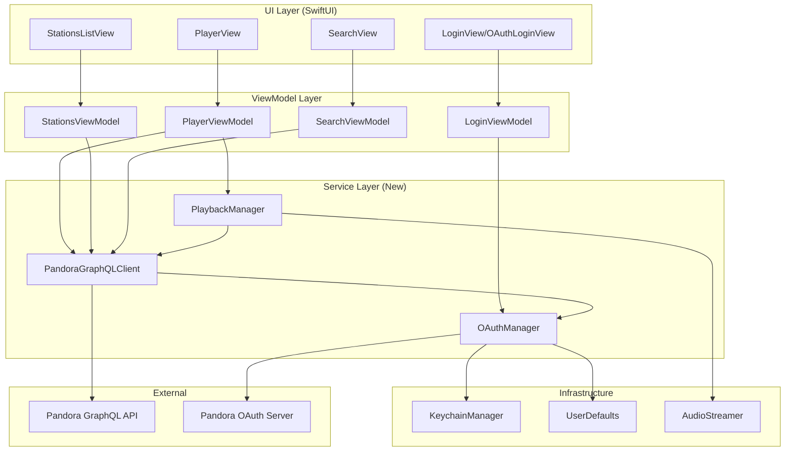
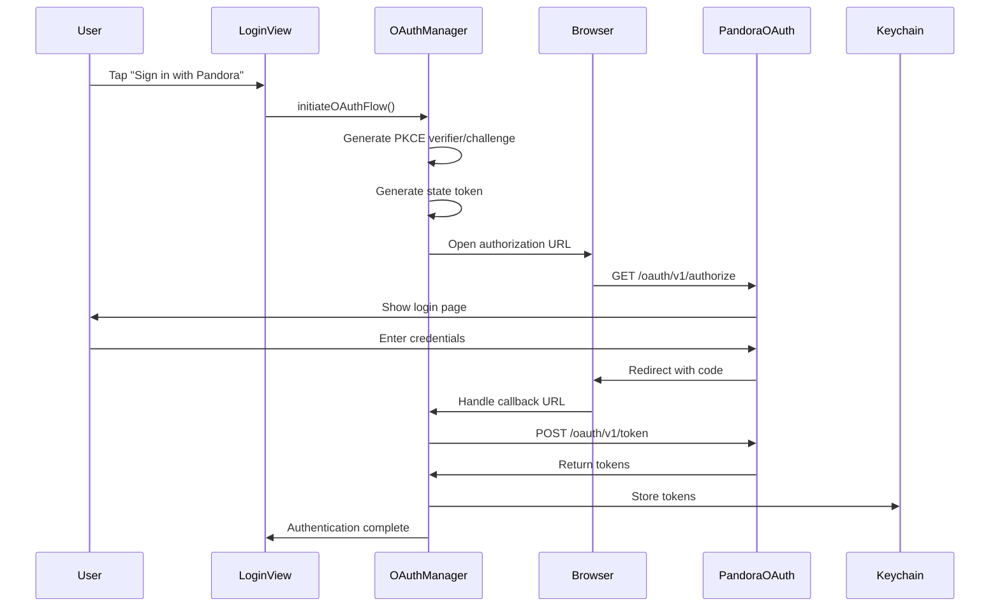
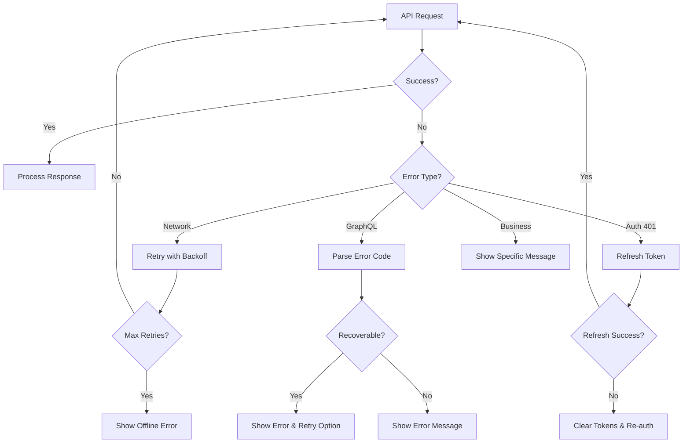

# Design Document: Pandora GraphQL API Migration

## Overview

This design document describes the architecture and implementation approach for migrating Hermes from the legacy Pandora JSON API v5 to the official Pandora GraphQL Partner API. The migration involves three major components:

1. **OAuth 2.0 Authentication** - Replacing Blowfish-encrypted partner/user login with OAuth 2.0 Authorization Code Grant with PKCE
2. **GraphQL Client Layer** - A new Swift-native GraphQL client replacing the Objective-C JSON-RPC implementation
3. **Data Model Updates** - Adapting models to support the new API's Station/Station Factory paradigm and track interaction rights

The design follows modern Swift/SwiftUI patterns with async/await, Combine publishers, and type-safe GraphQL operations. The implementation will be phased to allow incremental migration while maintaining app functionality.

## Architecture



### Component Responsibilities

| Component | Responsibility |
|-----------|---------------|
| OAuthManager | OAuth 2.0 flow, token storage/refresh, PKCE generation |
| PandoraGraphQLClient | GraphQL query/mutation execution, response parsing, error mapping |
| PlaybackManager | Coordinates playback state, progress reporting, audio URL refresh |
| KeychainManager | Secure storage of OAuth tokens and device UUID |
| AudioStreamer | Audio playback (existing Objective-C component) |

### Data Flow



## Components and Interfaces

### OAuthManager

```swift
/// Manages OAuth 2.0 authentication with Pandora
@MainActor
final class OAuthManager: ObservableObject {
    // MARK: - Published State
    @Published private(set) var isAuthenticated: Bool = false
    @Published private(set) var isAuthenticating: Bool = false
    
    // MARK: - Configuration
    private let clientId: String
    private let clientSecret: String
    private let redirectUri: String
    private let authorizationEndpoint = URL(string: "https://www.pandora.com/oauth/v1/authorize")!
    private let tokenEndpoint = URL(string: "https://www.pandora.com/oauth/v1/token")!
    
    // MARK: - PKCE State
    private var codeVerifier: String?
    private var stateToken: String?
    
    // MARK: - Public Interface
    
    /// Initiates the OAuth authorization flow
    func initiateOAuthFlow() async throws
    
    /// Handles the OAuth callback URL
    func handleCallback(url: URL) async throws
    
    /// Returns a valid access token, refreshing if necessary
    func getValidAccessToken() async throws -> String
    
    /// Clears all stored tokens and signs out
    func signOut()
    
    /// Checks if legacy credentials exist and need migration
    func hasLegacyCredentials() -> Bool
}
```

### PandoraGraphQLClient

```swift
/// GraphQL client for Pandora API
actor PandoraGraphQLClient {
    private let endpoint = URL(string: "https://ce.pandora.com/api/v1/graphql/graphql")!
    private let oauthManager: OAuthManager
    private let deviceUUID: String
    
    // MARK: - Query/Mutation Execution
    
    /// Executes a GraphQL query
    func query<T: Decodable>(_ operation: GraphQLOperation) async throws -> T
    
    /// Executes a GraphQL mutation
    func mutate<T: Decodable>(_ operation: GraphQLOperation) async throws -> T
    
    // MARK: - Collection Operations
    
    /// Fetches the user's station collection
    func fetchStations(
        sortBy: CollectionSortField?,
        sortOrder: SortOrder?,
        limit: Int?,
        cursor: String?
    ) async throws -> StationCollectionResponse
    
    // MARK: - Playback Operations
    
    /// Sets a playback source (station, album, etc.)
    func setSource(sourceId: String) async throws -> PlaybackSourceResponse
    
    /// Gets the current playback state for this device
    func getCurrentPlayback() async throws -> PlaybackCurrentResponse?
    
    /// Skips to the next track
    func skip(trackToken: String) async throws -> PlaybackSkipResponse
    
    /// Reports playback progress
    func setProgress(trackToken: String, elapsedTime: Int) async throws
    
    /// Marks a track as ended
    func setEnded(trackToken: String) async throws -> PlaybackEndedResponse
    
    // MARK: - Feedback Operations
    
    /// Sets feedback (thumbs up/down) on a track
    func setFeedback(
        targetId: String,
        sourceContextId: String,
        value: FeedbackValue,
        trackToken: String,
        elapsedTime: Int
    ) async throws -> FeedbackResponse
    
    /// Removes feedback from a track
    func removeFeedback(targetId: String, sourceContextId: String) async throws
    
    // MARK: - Search Operations
    
    /// Searches for content
    func search(
        query: String,
        types: [SearchType],
        limit: Int?,
        cursor: String?
    ) async throws -> SearchResponse
}
```

### PlaybackManager

```swift
/// Coordinates playback state and audio streaming
@MainActor
final class PlaybackManager: ObservableObject {
    // MARK: - Published State
    @Published private(set) var currentTrack: TrackItem?
    @Published private(set) var currentSource: PlaybackSource?
    @Published private(set) var isPlaying: Bool = false
    @Published private(set) var progress: TimeInterval = 0
    @Published private(set) var duration: TimeInterval = 0
    @Published private(set) var availableInteractions: Set<TrackInteraction> = []
    
    // MARK: - Dependencies
    private let graphQLClient: PandoraGraphQLClient
    private let audioStreamer: AudioStreamer
    private var progressReportingTask: Task<Void, Never>?
    
    // MARK: - Public Interface
    
    /// Starts playback on a source
    func play(sourceId: String) async throws
    
    /// Pauses playback
    func pause()
    
    /// Resumes playback
    func resume()
    
    /// Skips to the next track
    func skip() async throws
    
    /// Gives thumbs up to current track
    func thumbsUp() async throws
    
    /// Gives thumbs down to current track (also skips)
    func thumbsDown() async throws
    
    /// Removes feedback from current track
    func removeFeedback() async throws
}
```

### GraphQL Operation Types

```swift
/// Represents a GraphQL operation (query or mutation)
struct GraphQLOperation {
    let operationName: String?
    let query: String
    let variables: [String: Any]
}

/// GraphQL response wrapper
struct GraphQLResponse<T: Decodable>: Decodable {
    let data: T?
    let errors: [GraphQLError]?
}

/// GraphQL error
struct GraphQLError: Decodable, Error {
    let message: String
    let locations: [GraphQLErrorLocation]?
    let path: [String]?
    let extensions: GraphQLErrorExtensions?
}

struct GraphQLErrorLocation: Decodable {
    let line: Int
    let column: Int
}

struct GraphQLErrorExtensions: Decodable {
    let code: String?
}
```

## Data Models

### OAuth Models

```swift
/// OAuth token response from Pandora
struct OAuthTokenResponse: Codable {
    let accessToken: String
    let refreshToken: String
    let expiresIn: Int
    let tokenType: String
    
    enum CodingKeys: String, CodingKey {
        case accessToken = "access_token"
        case refreshToken = "refresh_token"
        case expiresIn = "expires_in"
        case tokenType = "token_type"
    }
}

/// Stored OAuth credentials
struct StoredOAuthCredentials: Codable {
    let accessToken: String
    let refreshToken: String
    let expirationDate: Date
}
```

### Station Models

```swift
/// Station from GraphQL API (user-specific)
struct GraphQLStation: Decodable, Identifiable {
    let id: String          // Format: "ST:0:1234567890"
    let name: String
    let art: ArtworkInfo?
    
    var stationType: StationType {
        id.hasPrefix("ST:") ? .station : .stationFactory
    }
}

/// Station Factory (template, not user-specific)
struct GraphQLStationFactory: Decodable, Identifiable {
    let id: String          // Format: "SF:16722:269367"
    let name: String
    let art: ArtworkInfo?
}

/// Artwork information
struct ArtworkInfo: Decodable {
    let url: String?
}

/// Station type enumeration
enum StationType {
    case station        // ST - User-specific
    case stationFactory // SF - Template
}

/// Collection response
struct StationCollectionResponse: Decodable {
    let collection: CollectionData
}

struct CollectionData: Decodable {
    let items: [GraphQLStation]
    let pageInfo: PageInfo?
}

struct PageInfo: Decodable {
    let hasNextPage: Bool
    let endCursor: String?
}
```

### Playback Models

```swift
/// Playback source response
struct PlaybackSourceResponse: Decodable {
    let playback: PlaybackData
}

struct PlaybackData: Decodable {
    let setSource: SetSourceResult?
    let current: TrackItem?
}

struct SetSourceResult: Decodable {
    let id: String
    let type: String
    let current: TrackItem?
}

/// Track item in playback
struct TrackItem: Decodable {
    let audioUrl: String
    let interactions: [String]
    let index: Int
    let trackToken: String
    let track: TrackMetadata
    let feedbackValue: FeedbackValue?
    
    var availableInteractions: Set<TrackInteraction> {
        Set(interactions.compactMap { TrackInteraction(rawValue: $0) })
    }
}

/// Track metadata
struct TrackMetadata: Decodable {
    let name: String?
    let duration: Int
    let art: ArtworkInfo?
    let artist: ArtistInfo?
    let album: AlbumInfo?
}

struct ArtistInfo: Decodable {
    let name: String
}

struct AlbumInfo: Decodable {
    let name: String?
}

/// Track interactions
enum TrackInteraction: String, CaseIterable {
    case skip = "SKIP"
    case replay = "REPLAY"
    case thumb = "THUMB"
}

/// Feedback value
enum FeedbackValue: String, Codable {
    case up = "UP"
    case down = "DOWN"
}
```

### Search Models

```swift
/// Search response
struct SearchResponse: Decodable {
    let search: SearchData
}

struct SearchData: Decodable {
    let items: [SearchItem]
    let pageInfo: PageInfo?
}

/// Search result item (union type)
enum SearchItem: Decodable {
    case station(GraphQLStation)
    case stationFactory(GraphQLStationFactory)
    case artist(ArtistSearchResult)
    case track(TrackSearchResult)
    case album(AlbumSearchResult)
    
    var id: String {
        switch self {
        case .station(let s): return s.id
        case .stationFactory(let sf): return sf.id
        case .artist(let a): return a.id
        case .track(let t): return t.id
        case .album(let al): return al.id
        }
    }
}

struct ArtistSearchResult: Decodable, Identifiable {
    let id: String      // Format: "AR:123456"
    let name: String
    let art: ArtworkInfo?
}

struct TrackSearchResult: Decodable, Identifiable {
    let id: String      // Format: "TR:123456"
    let name: String
    let artist: ArtistInfo?
    let art: ArtworkInfo?
}

struct AlbumSearchResult: Decodable, Identifiable {
    let id: String      // Format: "AL:123456"
    let name: String
    let artist: ArtistInfo?
    let art: ArtworkInfo?
}

/// Search types
enum SearchType: String {
    case station = "ST"
    case stationFactory = "SF"
    case artist = "AR"
    case track = "TR"
    case album = "AL"
    case podcast = "PC"
    case playlist = "PL"
}
```

### Error Models

```swift
/// Pandora API errors
enum PandoraAPIError: Error, LocalizedError {
    case networkError(underlying: Error)
    case authenticationRequired
    case tokenRefreshFailed
    case graphQLError(message: String, code: String?)
    case invalidResponse
    case notSupported(feature: String)
    case skipLimitReached
    case noCleanContent
    
    var errorDescription: String? {
        switch self {
        case .networkError(let error):
            return "Network error: \(error.localizedDescription)"
        case .authenticationRequired:
            return "Please sign in to continue"
        case .tokenRefreshFailed:
            return "Session expired. Please sign in again."
        case .graphQLError(let message, _):
            return message
        case .invalidResponse:
            return "Invalid response from server"
        case .notSupported(let feature):
            return "\(feature) is not available with your subscription"
        case .skipLimitReached:
            return "Skip limit reached. Try again later."
        case .noCleanContent:
            return "No clean version available for this content"
        }
    }
}
```

## Correctness Properties

*A property is a characteristic or behavior that should hold true across all valid executions of a system—essentially, a formal statement about what the system should do. Properties serve as the bridge between human-readable specifications and machine-verifiable correctness guarantees.*

### Property 1: OAuth URL Construction

*For any* valid client_id, redirect_uri, scope, state, and code_challenge values, the OAuth authorization URL constructed by OAuthManager SHALL contain all parameters properly URL-encoded as query parameters.

**Validates: Requirements 1.1**

### Property 2: PKCE Round-Trip

*For any* randomly generated code_verifier string, computing the code_challenge as BASE64URL(SHA256(code_verifier)) and then verifying the challenge against the original verifier SHALL succeed.

**Validates: Requirements 1.7**

### Property 3: State Parameter Validation

*For any* randomly generated state token, the state returned in the OAuth callback SHALL match the originally sent state, and mismatched states SHALL be rejected.

**Validates: Requirements 1.8**

### Property 4: Token Storage Round-Trip

*For any* valid OAuthTokenResponse containing access_token, refresh_token, and expiration time, serializing to Keychain and then deserializing SHALL produce an equivalent StoredOAuthCredentials object.

**Validates: Requirements 1.3, 13.1, 13.2**

### Property 5: Bearer Token Header

*For any* GraphQL request and any valid access_token, the HTTP request SHALL include an Authorization header with value "Bearer {access_token}".

**Validates: Requirements 2.1, 2.2**

### Property 6: GraphQL Operation Serialization

*For any* GraphQLOperation with operationName, query, and variables, serializing to JSON SHALL produce a valid JSON object containing all three fields with correct values.

**Validates: Requirements 2.3**

### Property 7: GraphQL Response Parsing Round-Trip

*For any* valid GraphQL response JSON containing data and/or errors, parsing into `GraphQLResponse<T>` and then re-serializing SHALL produce equivalent JSON structure.

**Validates: Requirements 2.4**

### Property 8: GraphQL Error Extraction

*For any* GraphQL response containing an errors array, the GraphQL_Client SHALL extract all error messages and codes, and the resulting PandoraAPIError SHALL contain the original error information.

**Validates: Requirements 2.5**

### Property 9: Device UUID Uniqueness

*For any* two calls to generate a Device_UUID, the generated UUIDs SHALL be valid UUID format and SHALL be unique (no collisions).

**Validates: Requirements 3.1**

### Property 10: Device UUID Inclusion in Playback

*For any* playback-related GraphQL operation (setSource, getCurrentPlayback, skip, setProgress, setEnded), the operation SHALL include the deviceUuid parameter.

**Validates: Requirements 3.2**

### Property 11: Station Parsing

*For any* valid GraphQL station response JSON containing id, name, and art fields, parsing into GraphQLStation SHALL extract all fields correctly with matching values.

**Validates: Requirements 4.2**

### Property 12: SetSource Mutation Construction

*For any* station ID and device UUID, the setSource mutation SHALL include both the sourceId and deviceUuid as parameters in the GraphQL operation.

**Validates: Requirements 5.1**

### Property 13: Track Metadata Parsing

*For any* valid TrackItem JSON containing audioUrl, trackToken, interactions, and track metadata, parsing SHALL extract all fields correctly including nested artist and album information.

**Validates: Requirements 5.2**

### Property 14: Audio URL Expiration Tracking

*For any* audio URL received with a known source type, the expiration time SHALL be calculated as 5 minutes for on-demand sources and 1 hour for station sources, and the isExpired check SHALL return true only after the expiration time has passed.

**Validates: Requirements 6.2**

### Property 15: Feedback Mutation Construction

*For any* feedback operation with targetId, sourceContextId, trackToken, deviceUuid, elapsedTime, and feedback value, the setFeedback mutation SHALL include all parameters in the GraphQL operation.

**Validates: Requirements 7.1**

### Property 16: Interaction-Based UI State

*For any* track with a given interactions array, the UI state SHALL reflect: skip button disabled if SKIP not in interactions, replay button disabled if REPLAY not in interactions, and feedback buttons disabled if THUMB not in interactions.

**Validates: Requirements 7.4, 10.2, 10.3**

### Property 17: Search Query Construction

*For any* search query string and array of search types, the search GraphQL query SHALL include the query string and types array as parameters.

**Validates: Requirements 8.1**

### Property 18: Search Result Parsing

*For any* valid search response JSON containing items with id, name, type, and art fields, parsing into SearchItem models SHALL extract all fields correctly for each result type (SF, ST, AR, TR, AL).

**Validates: Requirements 8.2**

### Property 19: Station Factory to Station Conversion

*For any* setSource response where the input was a Station Factory (SF) ID, the response SHALL contain a Station (ST) ID, and parsing SHALL correctly identify the returned station.

**Validates: Requirements 9.2**

### Property 20: Interactions Array Parsing

*For any* interactions array containing valid interaction strings, parsing into Set<TrackInteraction> SHALL include all valid interactions and exclude invalid strings.

**Validates: Requirements 10.1**

### Property 21: Error Code to Message Mapping

*For any* known GraphQL error code, the error mapping function SHALL return a non-empty, user-friendly error message.

**Validates: Requirements 11.1**

### Property 22: Progress Mutation Construction

*For any* progress report with deviceUuid, elapsedTime, and trackToken, the setProgress mutation SHALL include all three parameters in the GraphQL operation.

**Validates: Requirements 14.2**

### Property 23: Subscription-Based Feature Gating

*For any* subscription tier (free, plus, premium), the feature availability SHALL correctly reflect: free tier allows only stations and podcasts, plus tier allows additional features, and premium tier allows on-demand playback of albums, tracks, and playlists.

**Validates: Requirements 15.2, 15.3, 15.4**

## Error Handling

### Error Categories

| Category | Examples | Handling Strategy |
|----------|----------|-------------------|
| Network Errors | Connection timeout, DNS failure | Retry with exponential backoff, show offline indicator |
| Authentication Errors | Token expired, invalid token | Automatic token refresh, re-authenticate if refresh fails |
| GraphQL Errors | Invalid query, server error | Parse error code, map to user message, log for debugging |
| Business Logic Errors | Skip limit, no clean content | Display specific error message, disable related UI |
| Playback Errors | Audio URL expired, stream failed | Request new URL, retry playback |

### Error Recovery Flow



### Error Mapping

```swift
extension PandoraAPIError {
    static func from(graphQLError: GraphQLError) -> PandoraAPIError {
        switch graphQLError.extensions?.code {
        case "UNAUTHENTICATED":
            return .authenticationRequired
        case "NOT_SUPPORTED":
            return .notSupported(feature: graphQLError.message)
        case "SKIP_LIMIT_REACHED":
            return .skipLimitReached
        case "NO_CLEAN_CONTENT":
            return .noCleanContent
        default:
            return .graphQLError(
                message: graphQLError.message,
                code: graphQLError.extensions?.code
            )
        }
    }
}
```

## Testing Strategy

### Dual Testing Approach

This migration requires both unit tests and property-based tests to ensure correctness:

- **Unit Tests**: Verify specific examples, edge cases, integration points, and error conditions
- **Property Tests**: Verify universal properties across all valid inputs using randomized testing

### Property-Based Testing Configuration

- **Library**: SwiftCheck or swift-composable-architecture's testing utilities
- **Minimum Iterations**: 100 per property test
- **Tag Format**: `Feature: graphql-api-migration, Property {number}: {property_text}`

### Test Categories

#### Unit Tests

1. **OAuth Flow Tests**
   - Test authorization URL construction with specific parameters
   - Test token exchange with mocked responses
   - Test token refresh flow
   - Test error handling for invalid codes/tokens

2. **GraphQL Client Tests**
   - Test query/mutation serialization
   - Test response parsing for each model type
   - Test error response handling
   - Test retry logic with mocked failures

3. **Playback Manager Tests**
   - Test state transitions (playing, paused, stopped)
   - Test progress reporting timing
   - Test audio URL refresh before expiration
   - Test skip limit handling

4. **Integration Tests**
   - Test full OAuth flow with test credentials
   - Test station fetch and playback flow
   - Test feedback submission flow
   - Test search and station creation flow

#### Property-Based Tests

Each correctness property from the design document should have a corresponding property-based test:

```swift
// Example: Property 4 - Token Storage Round-Trip
func testTokenStorageRoundTrip() {
    property("Token storage round-trip preserves all fields") <- forAll { (token: OAuthTokenResponse) in
        let stored = StoredOAuthCredentials(from: token)
        let keychain = MockKeychain()
        
        try keychain.store(stored)
        let retrieved = try keychain.retrieve()
        
        return retrieved.accessToken == stored.accessToken
            && retrieved.refreshToken == stored.refreshToken
            && abs(retrieved.expirationDate.timeIntervalSince(stored.expirationDate)) < 1
    }
}

// Example: Property 6 - GraphQL Operation Serialization
func testGraphQLOperationSerialization() {
    property("GraphQL operations serialize to valid JSON") <- forAll { (op: GraphQLOperation) in
        let json = try op.toJSON()
        
        return json["query"] as? String == op.query
            && json["operationName"] as? String == op.operationName
            && (json["variables"] as? [String: Any])?.keys == op.variables.keys
    }
}
```

### Test Data Generators

```swift
// Generator for OAuth tokens
extension OAuthTokenResponse: Arbitrary {
    static var arbitrary: Gen<OAuthTokenResponse> {
        Gen.compose { c in
            OAuthTokenResponse(
                accessToken: c.generate(using: .alphanumericString(ofLength: 100)),
                refreshToken: c.generate(using: .alphanumericString(ofLength: 100)),
                expiresIn: c.generate(using: .int(in: 3600...86400)),
                tokenType: "Bearer"
            )
        }
    }
}

// Generator for GraphQL operations
extension GraphQLOperation: Arbitrary {
    static var arbitrary: Gen<GraphQLOperation> {
        Gen.compose { c in
            GraphQLOperation(
                operationName: c.generate(using: .optional(.alphanumericString(ofLength: 20))),
                query: c.generate(using: .alphanumericString(ofLength: 200)),
                variables: c.generate(using: .dictionary(keyGen: .alphanumericString(ofLength: 10), valueGen: .string))
            )
        }
    }
}
```

### Mocking Strategy

```swift
// Protocol for OAuth token provider
protocol TokenProvider {
    func getValidAccessToken() async throws -> String
}

// Mock implementation for testing
final class MockTokenProvider: TokenProvider {
    var tokenToReturn: String = "mock-token"
    var shouldFail: Bool = false
    var error: Error?
    
    func getValidAccessToken() async throws -> String {
        if shouldFail {
            throw error ?? PandoraAPIError.authenticationRequired
        }
        return tokenToReturn
    }
}

// Protocol for HTTP client
protocol HTTPClient {
    func execute(_ request: URLRequest) async throws -> (Data, HTTPURLResponse)
}

// Mock implementation for testing
final class MockHTTPClient: HTTPClient {
    var responses: [(Data, HTTPURLResponse)] = []
    var requestsReceived: [URLRequest] = []
    
    func execute(_ request: URLRequest) async throws -> (Data, HTTPURLResponse) {
        requestsReceived.append(request)
        guard !responses.isEmpty else {
            throw URLError(.badServerResponse)
        }
        return responses.removeFirst()
    }
}
```
