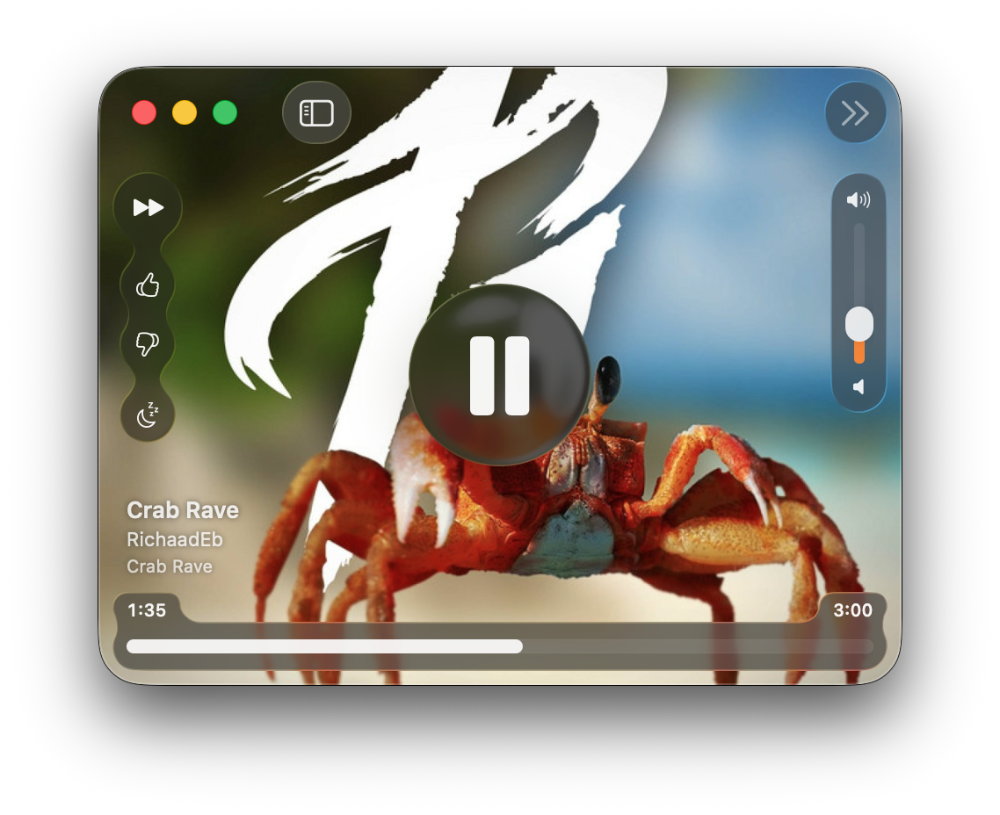
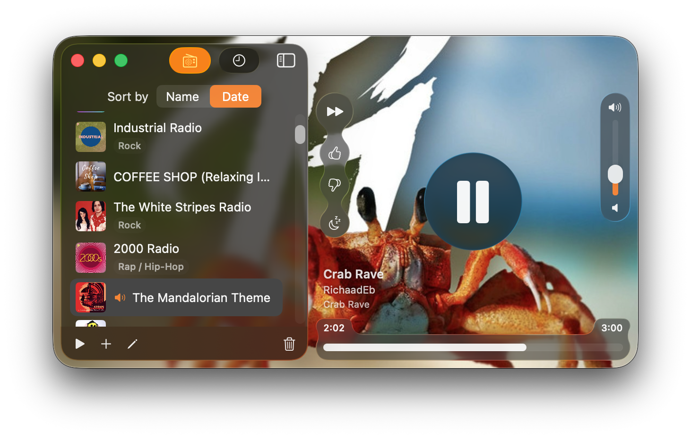
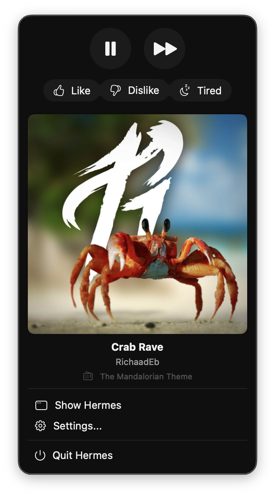
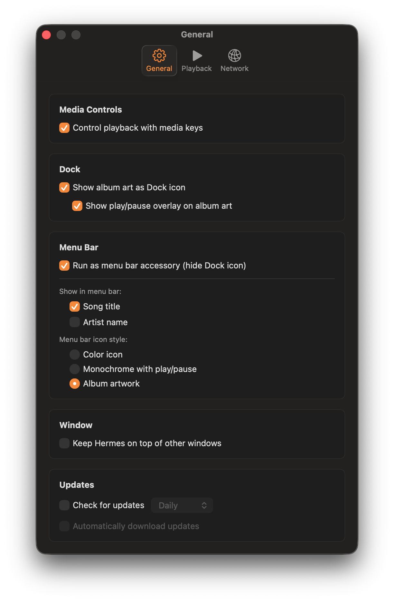

# Hermes - macOS Pandora Client

_Because sometimes you just want to listen to music_

[](https://travis-ci.org/HermesApp/Hermes)

A native [Pandora](http://www.pandora.com/) client for macOS, rebuilt from the ground up with SwiftUI.

---

## ✨ Hermes 2.0 — Completely Rebuilt for Modern macOS

After 7 years of dormancy, Hermes has been completely modernized for **macOS Tahoe (26.0)**. The entire UI has been rewritten in SwiftUI with a stunning new design that embraces Apple's latest Liquid Glass aesthetic.

### What's New

#### Full SwiftUI Rewrite

- Native SwiftUI views throughout — no more XIBs or legacy AppKit UI
- Smooth animations and transitions
- Responsive layout that adapts beautifully to any window size

#### Liquid Glass Design

- Translucent glass-effect controls that float over album artwork
- Controls fade elegantly when you're not interacting with the window
- Modern button styles with the new `.glassEffect()` modifier

<!-- Screenshot: Main player view with glass controls over album art -->


#### Immersive Album Art Experience

- Full-window album artwork as the background
- Click anywhere to open a dedicated album art preview window
- Artwork intelligently cached for instant display

<!-- Screenshot: Album art preview window -->


#### Redesigned Sidebar

- Clean stations list with lazy-loaded artwork
- Integrated history view with quick actions
- Sortable by name or date created
- Collapsible for a compact player mode

<!-- Screenshot: Sidebar with stations list -->


#### Rich Menu Bar Integration

- Full playback controls in the menu bar dropdown
- Album artwork thumbnail display
- Quick access to like/dislike/tired actions
- Configurable icon: color, monochrome, or album art

<!-- Screenshot: Menu bar dropdown -->


#### Modern Preferences

- Tabbed settings with General, Playback, and Network sections
- Clean grouped layout with modern styling
- All preferences take effect immediately

<!-- Screenshot: Preferences window -->


#### Under the Hood

- Swift 5.0+ with modern language features
- Comprehensive unit test suite
- Improved memory management and performance
- Better integration with system services
- Enhanced networking layer with proper connection handling
- Proper handling of account authentication and session management
- Better handling of network interruptions and reconnections
- Automatic token refresh — no more random logouts
- Disk-cached station artwork for faster loading
- Improved error handling with clear UI feedback
- Comprehensive unit test suite
- Proper async/await patterns throughout

### System Requirements

Hermes requires **macOS Tahoe (26.0)** or later.

---

### Download Hermes

- Click Download at [hermesapp.org](http://hermesapp.org/).
- Or install using [Homebrew](http://brew.sh)/[Caskroom](https://caskroom.github.io): `brew cask install hermes`.

If you would like to compile Hermes, continue reading.

### Develop against Hermes

Thanks to the suggestions by [blalor](https://github.com/blalor), there's a few
ways you can develop against Hermes if you really want to.

1. `NSDistributedNotificationCenter` - Every time a new song plays, a
   notification is posted with the name `hermes.song` under the object `hermes`
   with `userInfo` as a dictionary representing the song being played. See
   [Song.m](https://github.com/HermesApp/Hermes/blob/master/Sources/Pandora/Song.m#L29)
   for the keys available to you.

2. AppleScript - here's an example script:

```applescript
tell application "Hermes"
  play          -- resumes playback, does nothing if playing
  pause         -- pauses playback, does nothing if not playing
  playpause     -- toggles playback between pause/play
  next song     -- goes to the next song
  get playback state
  set playback state to playing

  thumbs up     -- likes the current song
  thumbs down   -- dislikes the current song, going to another one
  tired of song -- sets the current song as being "tired of"

  raise volume  -- raises the volume partially
  lower volume  -- lowers the volume partially
  full volume   -- raises volume to max
  mute          -- mutes the volume
  unmute        -- unmutes the volume to the last state from mute

  -- integer 0 to 100 for the volume
  get playback volume
  set playback volume to 92

  -- Working with the current station
  set stationName to the current station's name
  set stationId to station 2's stationId
  set the current station to station 4

  -- Getting information from the current song
  set title to the current song's title
  set artist to the current song's artist
  set album to the current song's album
  ... etc
end tell
```

### Contributing

Hermes is actively maintained and we welcome contributions!

1. **Report Issues** - [Open a ticket](https://github.com/HermesApp/Hermes/issues) for bugs or feature requests. We're actively monitoring and responding to issues.

2. **Submit Pull Requests** - We love contributions! The codebase has been modernized with:
   - SwiftUI views and view models
   - Modern Swift concurrency (async/await)
   - Comprehensive unit tests
   - Clear architecture with separation of concerns

### Building Hermes

Common build commands:

```bash
make                    # Build with Debug configuration
make run                # Build and run (logs to stdout)
make dbg                # Build and run in LLDB debugger

# Release builds
make CONFIGURATION=Release
make CONFIGURATION=Release run
```

### Development Guidelines

The project follows modern macOS development practices:

- **SwiftUI-first** - All new UI should be SwiftUI
- **View models** - Business logic lives in `@ObservableObject` view models
- **Async/await** - Use Swift concurrency for asynchronous operations
- **Testing** - Add unit tests for new functionality in `HermesTests/`
- **Documentation** - Check `.kiro/steering/` for architecture and conventions

See [Documentation/Contributing.md](Documentation/Contributing.md) for detailed guidelines.

## License

Code is available under the [MIT
License](https://github.com/HermesApp/Hermes/blob/master/LICENSE).
