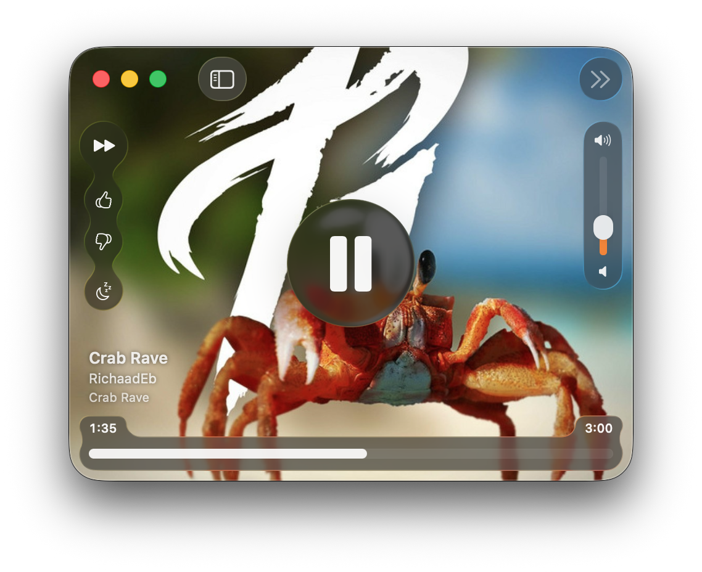
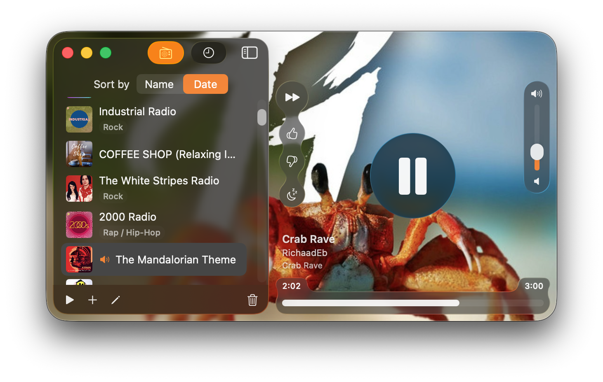
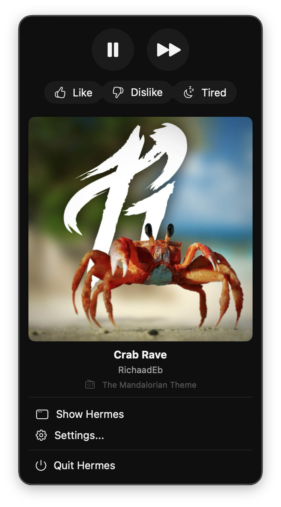
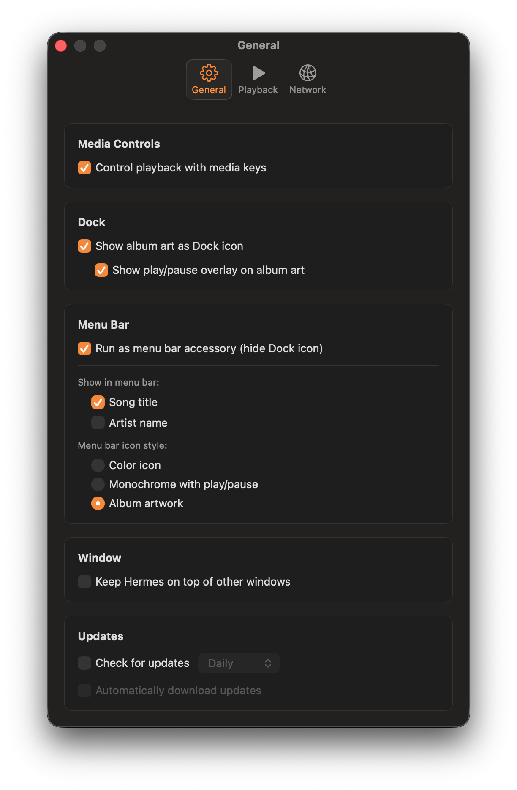

# Hermes — macOS Pandora Client

_Because sometimes you just want to listen to music_

A native [Pandora](http://www.pandora.com/) client for macOS, rebuilt from the ground up with SwiftUI.

---

## Hermes 2.0 — Completely Rebuilt for Modern macOS

After 7 years of dormancy, Hermes has been completely modernized for **macOS Tahoe (26.0)**. The entire UI has been rewritten in SwiftUI with a stunning new design that embraces Apple's latest Liquid Glass aesthetic.

### What's New

#### Full SwiftUI Rewrite

- Native SwiftUI views throughout — no more XIBs or legacy AppKit UI
- Smooth animations and transitions
- Responsive layout that adapts beautifully to any window size

#### Liquid Glass Design

- Translucent glass-effect controls that float over album artwork
- Controls fade elegantly when you're not interacting with the window
- Modern button styles with the new `.glassEffect()` modifier



#### Immersive Album Art Experience

- Full-window album artwork as the background
- Click anywhere to open a dedicated album art preview window
- Album art window supports native macOS fullscreen
- Artwork intelligently cached for instant display


#### Redesigned Sidebar

- Clean stations list with lazy-loaded artwork
- Integrated history view with quick actions
- Sortable by name or date created
- Collapsible for a compact player mode



#### Rich Menu Bar Integration

- Full playback controls in the menu bar dropdown
- Album artwork thumbnail display
- Quick access to like/dislike/tired actions
- Configurable icon: color, monochrome, or album art



#### Modern Preferences

- Tabbed settings with General, Playback, and Network sections
- Clean grouped layout with modern styling
- All preferences take effect immediately



#### Under the Hood

- Swift 5.0+ with modern language features
- Async/await patterns throughout
- Comprehensive unit test suite
- Improved memory management and performance
- Better network handling with automatic reconnection
- Automatic token refresh — no more random logouts
- Disk-cached station artwork for faster loading
- Clear error handling with user-friendly feedback

### System Requirements

Hermes requires **macOS Tahoe (26.0)** or later.

---

## Download

- Download from [hermesapp.org](http://hermesapp.org/)
- Or install via [Homebrew](http://brew.sh): `brew install --cask hermes`

---

## Features

- **Pandora streaming** with full authentication support
- **Station management** — create, rename, delete, and play stations
- **Playback controls** — play/pause, skip, volume, like/dislike, tired of song
- **Listening history** — view and interact with recently played songs
- **Media key support** — control playback with keyboard media keys
- **Native notifications** — song change notifications via macOS
- **Last.fm scrobbling** — track your listening history
- **AppleScript support** — automate Hermes with scripts
- **Menu bar integration** — control playback without switching apps

---

## Develop Against Hermes

### Distributed Notifications

Every time a new song plays, a notification is posted:

- **Name**: `hermes.song`
- **Object**: `hermes`
- **UserInfo**: Dictionary with song properties (title, artist, album, etc.)

### AppleScript

```applescript
tell application "Hermes"
  play          -- resumes playback
  pause         -- pauses playback
  playpause     -- toggles playback
  next song     -- skips to next song
  
  thumbs up     -- likes the current song
  thumbs down   -- dislikes and skips the current song
  tired of song -- marks song as "tired" and skips
  
  raise volume  -- increases volume
  lower volume  -- decreases volume
  mute / unmute -- mute controls
  
  get playback state
  set playback state to playing
  
  get playback volume
  set playback volume to 75
  
  set stationName to the current station's name
  set the current station to station 4
  
  set title to the current song's title
  set artist to the current song's artist
  set album to the current song's album
end tell
```

---

## Contributing

Hermes is actively maintained and welcomes contributions!

1. **Report Issues** — [Open a ticket](https://github.com/HermesApp/Hermes/issues) for bugs or feature requests
2. **Submit Pull Requests** — See [Contributing.md](Documentation/Contributing.md) for guidelines

### Building

```bash
make                    # Build with Debug configuration
make CONFIGURATION=Release  # Build with Release configuration
```

### Architecture

The codebase follows modern macOS development practices:

- **SwiftUI views** in `Sources/Swift/Views/`
- **View models** in `Sources/Swift/ViewModels/`
- **Services** in `Sources/Swift/Services/`
- **Unit tests** in `HermesTests/`

See `.kiro/steering/` for detailed architecture documentation.

---

## License

[MIT License](LICENSE)
